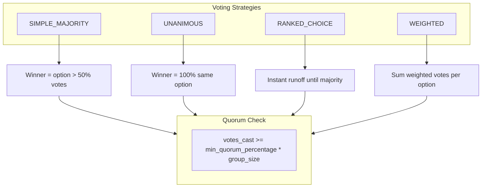

# Governance Module Implementation

## Current State

**Models exist** in `[mitlist/modules/governance/models.py](mitlist/modules/governance/models.py)`:

- `Proposal` - proposal with type, strategy, status, deadline, quorum
- `BallotOption` - options for voting
- `VoteRecord` - individual votes (supports ranked-choice)
- `VoteDelegation` - vote delegation by topic

**Schemas exist** (20 total) in `[mitlist/modules/governance/schemas.py](mitlist/modules/governance/schemas.py)`

**API endpoints** (all 501 stubs) in `[mitlist/modules/governance/api.py](mitlist/modules/governance/api.py)`:

- `GET /proposals` - List proposals
- `POST /proposals` - Create proposal
- `GET /proposals/{id}/options` - Get ballot options
- `POST /proposals/{id}/vote` - Cast vote
- `POST /proposals/{id}/close` - Close proposal and tally

**Service layer**: Empty

---

## Implementation Plan

### 1. Proposal CRUD Service

```python
async def list_proposals(db, group_id, status_filter=None) -> list[Proposal]
async def get_proposal_by_id(db, proposal_id) -> Proposal | None
async def create_proposal(db, group_id, created_by_id, title, type, strategy, deadline_at, options: list) -> Proposal
async def update_proposal(db, proposal_id, **updates) -> Proposal  # Only DRAFT status
async def cancel_proposal(db, proposal_id) -> Proposal  # Set CANCELLED
```

### 2. Voting Service

```python
async def cast_vote(db, proposal_id, user_id, ballot_option_id, rank_order=None, weight=1.0) -> VoteRecord
    # Validate proposal is OPEN
    # Validate user is group member
    # Check for existing vote (update or reject based on strategy)
    # Update ballot_option.vote_count

async def cast_ranked_votes(db, proposal_id, user_id, ranked_options: list[dict]) -> list[VoteRecord]
    # For RANKED_CHOICE strategy

async def get_user_vote(db, proposal_id, user_id) -> VoteRecord | None
```

### 3. Close and Tally Service

```python
async def close_proposal(db, proposal_id, closed_by_id) -> Proposal
    # Set status based on vote tally:
    # - SIMPLE_MAJORITY: option with >50% wins
    # - UNANIMOUS: all must vote same option
    # - RANKED_CHOICE: instant-runoff elimination
    # - Check quorum met
    # Return PASSED or REJECTED with execution_result JSON

async def execute_proposal(db, proposal_id) -> Proposal
    # For EXPENSE_REQUEST: create expense
    # For CHORE_ASSIGNMENT: create chore assignment
    # For KICK_USER: remove member from group
    # Set executed_at timestamp
```

### 4. Vote Delegation Service (Optional)

```python
async def create_delegation(db, group_id, delegator_id, delegate_id, topic_category) -> VoteDelegation
async def revoke_delegation(db, delegation_id) -> None
async def get_active_delegations(db, user_id, group_id) -> list[VoteDelegation]
```

### 5. Additional API Endpoints

| Method   | Path                      | Description                               |
| -------- | ------------------------- | ----------------------------------------- |
| `GET`    | `/proposals/{id}`         | Get proposal with options and vote counts |
| `PATCH`  | `/proposals/{id}`         | Update draft proposal                     |
| `DELETE` | `/proposals/{id}`         | Cancel proposal                           |
| `GET`    | `/proposals/{id}/results` | Get voting results summary                |

---

## Voting Strategy Logic



---

## Files to Modify

- `[mitlist/modules/governance/service.py](mitlist/modules/governance/service.py)` - Add all service functions
- `[mitlist/modules/governance/interface.py](mitlist/modules/governance/interface.py)` - Re-export service functions
- `[mitlist/modules/governance/api.py](mitlist/modules/governance/api.py)` - Implement endpoints
