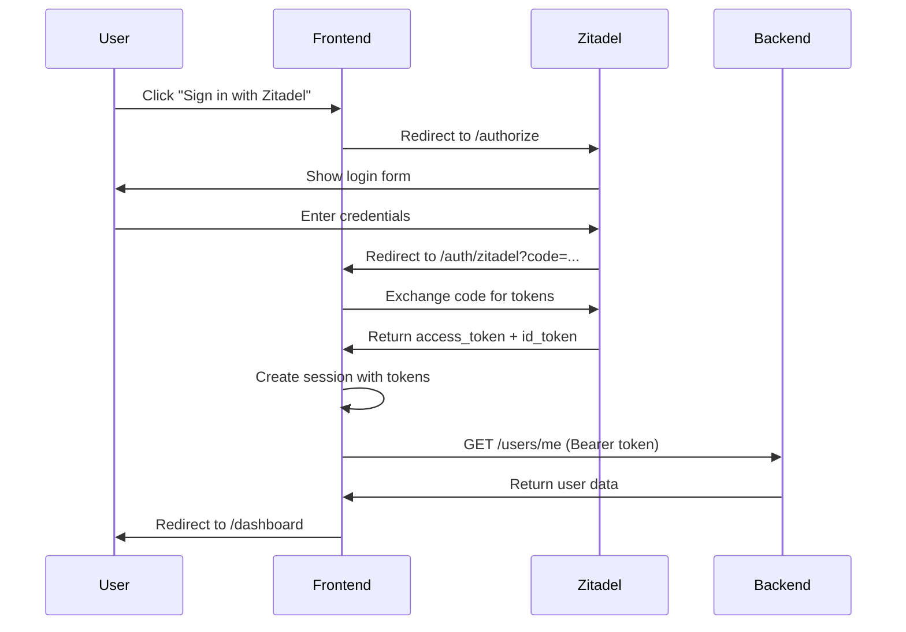

# Frontend Authentication and API Setup

## Overview

The Stride Client (Mitlist frontend) uses **Zitadel OIDC** for authentication and provides a complete TypeScript API layer for all backend modules.

## Authentication Flow

### 1. Zitadel OIDC Integration



### 2. Session Management

- **nuxt-auth-utils** handles session storage (encrypted cookie)
- Session contains: `{ user, accessToken }`
- Access token is automatically injected into API requests via `$api` plugin
- Session persists across page reloads

### 3. Auth Middleware

Global middleware (`app/middleware/auth.global.ts`) protects all routes except:

- `/login`
- `/register`

If no session exists, user is redirected to `/login`.

## API Layer Architecture

### Plugin: `app/plugins/api.ts`

Creates a custom `$fetch` instance with:

- **Base URL:** From `runtimeConfig.public.apiBase` (default: `http://localhost:8000/api/v1`)
- **Authorization header:** `Bearer {accessToken}` from session
- **Group context:** `X-Group-Id` header from `useState('current-group-id')`
- **Error handling:** 401 → redirect to `/login`

### Base Composable: `useApi()`

Wraps `useFetch` with the custom `$api` fetcher:

```typescript
export function useApi<T>(url: string, options?: UseFetchOptions<T>) {
  return useFetch<T>(url, {
    ...options,
    $fetch: useNuxtApp().$api,
  });
}
```

### Module Composables

Each backend module has a corresponding composable:

| Composable           | Endpoints                            | Purpose                                |
| -------------------- | ------------------------------------ | -------------------------------------- |
| `useAuth()`          | `/users`, `/groups`, `/invites`      | User management, groups, invitations   |
| `useChores()`        | `/chores`, `/chores/assignments`     | Chore management, assignments, stats   |
| `useFinance()`       | `/expenses`, `/balances`, `/budgets` | Expense tracking, settlements, budgets |
| `useLists()`         | `/lists`, `/inventory`               | Shopping lists, inventory              |
| `useNotifications()` | `/notifications`, `/comments`        | Notifications, comments, reactions     |
| `useGamification()`  | `/gamification/*`                    | Points, achievements, leaderboard      |
| `useGovernance()`    | `/proposals`                         | Voting, proposals                      |
| `useRecipes()`       | `/recipes`, `/meal-plans`            | Recipe management, meal planning       |
| `usePets()`          | `/pets`                              | Pet care, medical records              |
| `usePlants()`        | `/plants`                            | Plant care, schedules                  |
| `useAssets()`        | `/assets`                            | Home assets, maintenance               |
| `useDocuments()`     | `/documents`, `/credentials`         | Document storage, credentials          |
| `useAudit()`         | `/admin/*`                           | Audit logs, reports, tags              |
| `useCalendar()`      | `/calendar/feed`                     | Calendar events                        |

### Usage Pattern

**Reactive data fetching (for display):**

```typescript
const { data: chores, error, status } = await useChores().listChores();
```

**Mutations (for actions):**

```typescript
const chores = useChores()
await chores.createChore({ name: 'Clean kitchen', ... })
```

## Type Safety

All API types are defined in `app/types/` and match the backend Pydantic schemas:

```typescript
import type { ChoreResponse, ChoreCreate } from "~/types/chores";

const { data } = await useChores().listChores();
// data is typed as ChoreResponse[]
```

## Group Context

Many endpoints require a group context:

```typescript
const groupId = useCurrentGroupId();

// Set when user selects a group
groupId.value = 123;

// Plugin automatically sends X-Group-Id: 123 header
// Backend uses get_current_group_id() dependency to read it
```

## Environment Configuration

Required environment variables (`.env`):

```bash
# Backend API
NUXT_PUBLIC_API_BASE=http://localhost:8000/api/v1

# Zitadel OAuth
NUXT_OAUTH_ZITADEL_CLIENT_ID=your_client_id
NUXT_OAUTH_ZITADEL_CLIENT_SECRET=your_client_secret
NUXT_OAUTH_ZITADEL_SERVER_URL=https://your-zitadel.com

# Session encryption
NUXT_SESSION_PASSWORD=min_32_character_secret
```

## Dashboard Implementation

The dashboard (`app/pages/dashboard.vue`) demonstrates the auth + API pattern:

1. **Fetch user data:**

   ```typescript
   const { data: user } = await useAuth().getMe();
   ```

2. **Fetch user's groups:**

   ```typescript
   const { data: groups } = await useAuth().listGroups();
   ```

3. **Set current group:**

   ```typescript
   const groupId = useCurrentGroupId();
   if (groups.value?.length > 0) {
     groupId.value = groups.value[0].id;
   }
   ```

4. **Logout:**
   ```typescript
   const { clear } = useUserSession();
   await clear();
   await navigateTo("/login");
   ```

## Next Steps

1. ✅ OIDC authentication with Zitadel
2. ✅ Session management and auth middleware
3. ✅ Dashboard with user info and group selection
4. 🔄 Feature pages using composables (lists, chores, finance)
5. 🔄 Error handling UX (toast notifications)
6. 🔄 Loading states and skeleton screens
7. 🔄 Optimistic updates for mutations
